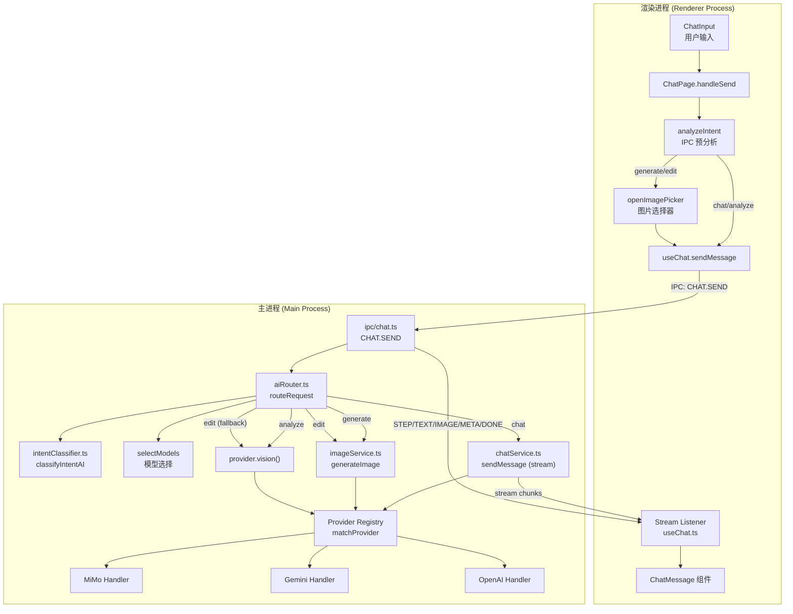
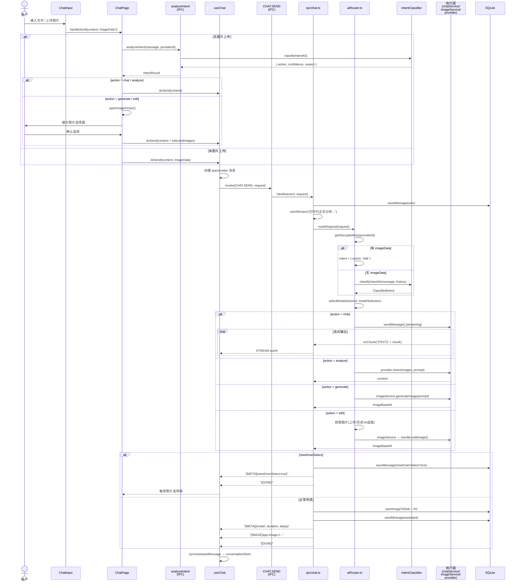
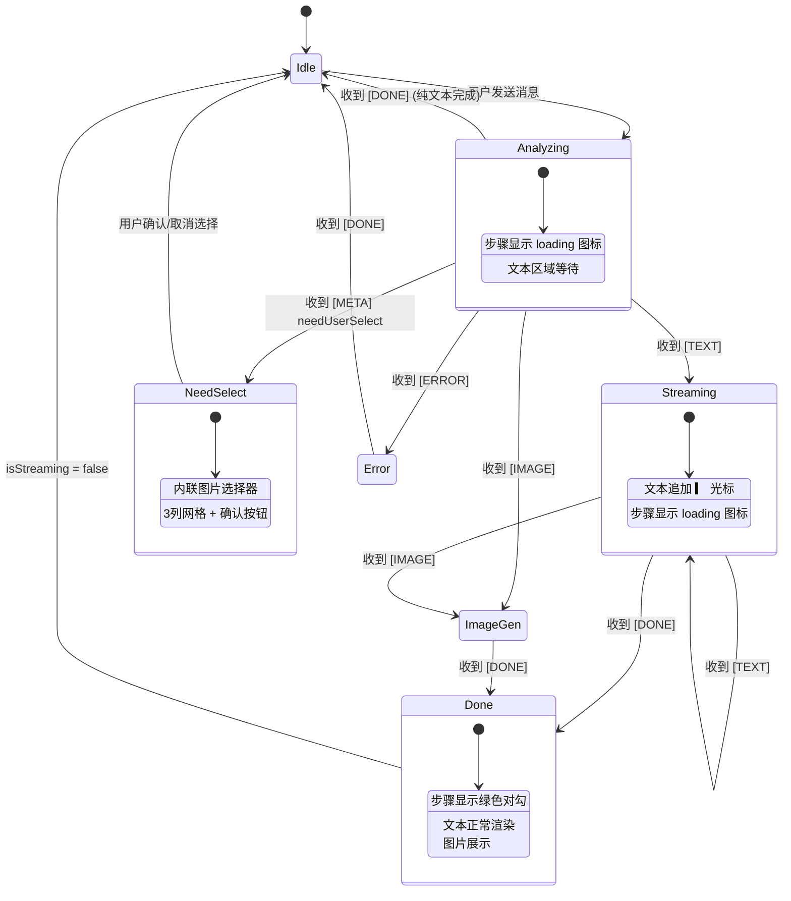
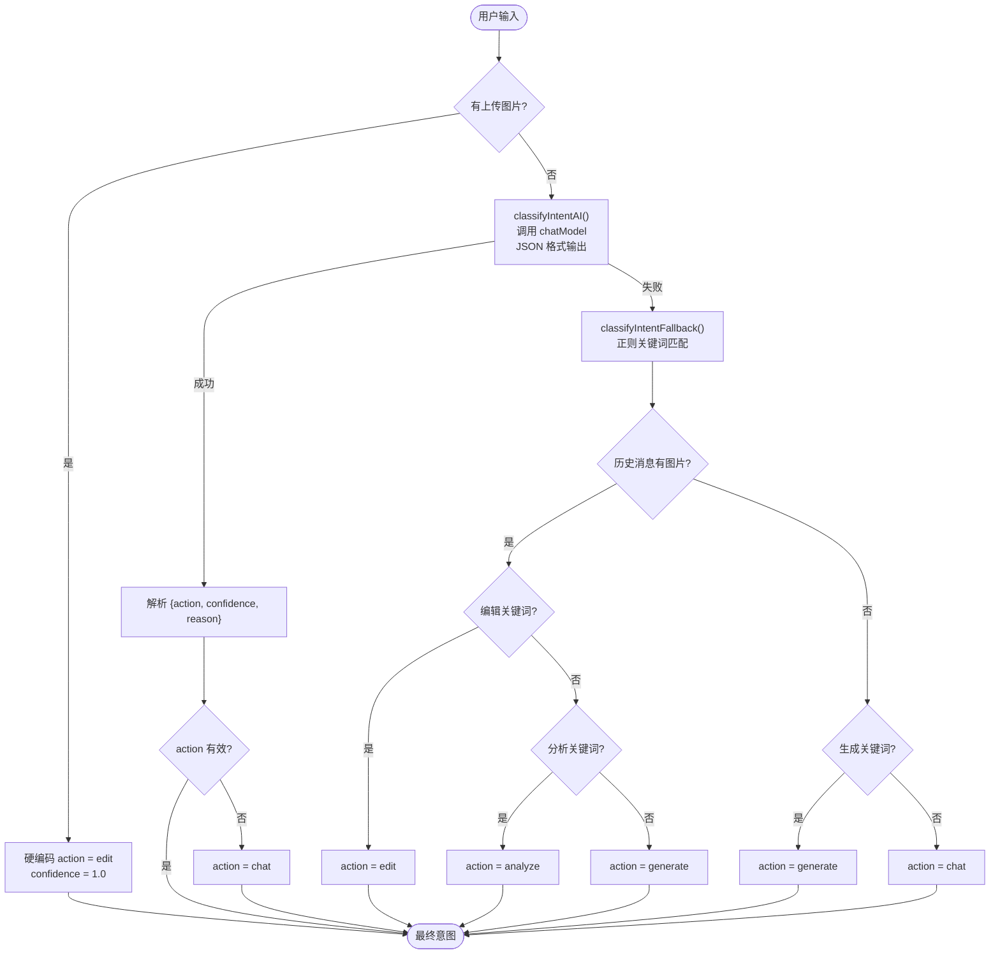
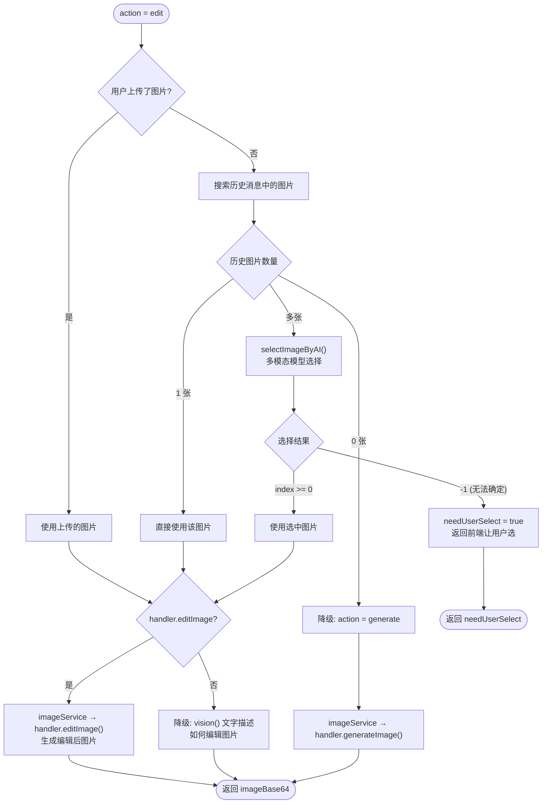
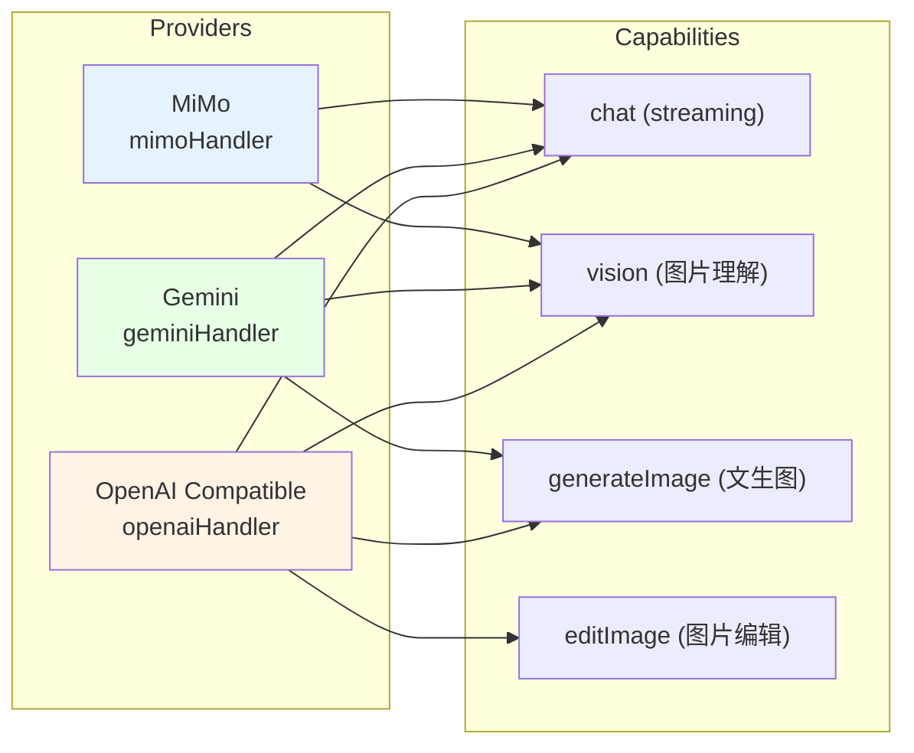
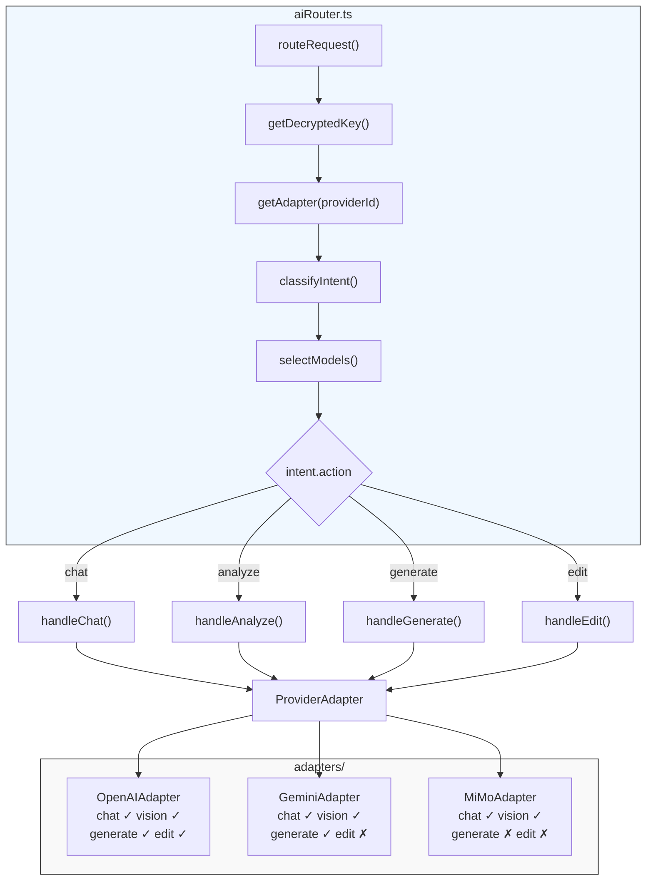
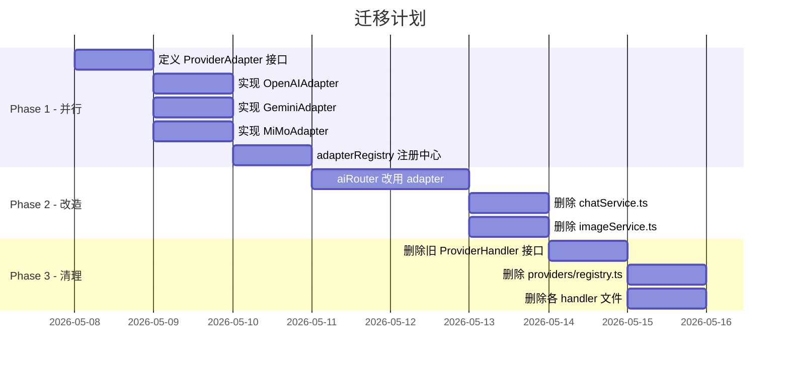

# ImageCreater 程序流程图 & 统一模型适配器优化方案

## 一、整体架构总览



---

## 二、前端发送 → 后端处理 时序图



---

## 三、流式协议状态机



---

## 四、意图分类决策流



---

## 五、Edit 意图执行流程



---

## 六、Provider 能力矩阵



---

## 七、IPC 流式协议

| 前缀 | 含义 | 数据格式 | 前端处理 |
|------|------|---------|---------|
| `[STEP]` | 处理步骤进度 | 纯文本，如 `"正在分析..."` | `streamState.steps.push()` |
| `[TEXT]` | 文本流式输出 | 纯文本片段 | `streamState.text += chunk` |
| `[IMAGE]` | 生成的图片 URL | URL 字符串 | `streamState.imageUrl = url` |
| `[PARTIAL_IMAGE]` | 图片生成中间态 | base64 片段 | 预览渲染 |
| `[META]` | 请求元数据 | JSON: `{model, duration, steps, action, ...}` | `streamState.metadata = parsed` |
| `[ERROR]` | 错误信息 | JSON: `{message, type, code}` | `streamState.error = parsed` |
| `[DONE]` | 流结束标记 | 无数据 | `setIsStreaming(convId, false)` |

---

## 八、当前架构问题分析

### 8.1 Provider 匹配依赖 URL 正则

- `matchProvider()` 通过 baseUrl 正则匹配 handler
- 新增 Provider 需要写正则 + 注册
- URL 不标准时匹配失败，静默 fallback 到 openaiHandler
- 用户无法手动指定使用哪个 handler

### 8.2 能力矩阵不统一

- `editImage` 是可选的，降级逻辑散落在 `aiRouter.ts` 和 `imageService.ts`
- MiMo 的 `generateImage()` 直接 throw，调用方需要 try-catch

### 8.3 职责分散

- `chatService.ts` 绕过 Provider Registry，直接用 OpenAI SDK
- `aiRouter.ts` 包含大量业务逻辑（意图分类、图片选择、降级策略）
- `imageService.ts` 只是一个薄代理层

### 8.4 缺少 chat() 方法

- `chatService.ts` 的 `sendMessage()` 是独立实现，不走 ProviderHandler 接口
- 导致 chat 和 vision/generate 使用不同的消息格式和调用路径

---

## 九、统一模型适配器优化方案

### 9.1 核心设计：ProviderAdapter 接口

```typescript
// src/main/services/providers/types.ts

export interface ChatMessage {
  role: 'system' | 'user' | 'assistant'
  content: string | ContentPart[]
}

export interface ContentPart {
  type: 'text' | 'image_url'
  text?: string
  image_url?: { url: string; detail?: 'low' | 'high' | 'auto' }
}

export interface ChatOptions {
  model: string
  messages: ChatMessage[]
  stream?: boolean
  temperature?: number
  maxTokens?: number
  onChunk?: (text: string) => void      // 流式回调
  signal?: AbortSignal                   // 取消信号
}

export interface VisionOptions {
  model: string
  prompt: string
  images: MessageImage[]
  maxTokens?: number
}

export interface ImageGenOptions {
  model: string
  prompt: string
  size?: string
  quality?: string
}

export interface ImageEditOptions {
  model: string
  prompt: string
  images: MessageImage[]
  mask?: MessageImage
}

// 能力声明 — 每个 adapter 声明自己支持什么
export interface ProviderCapabilities {
  chat: boolean            // 是否支持文本对话
  streaming: boolean       // 是否支持流式输出
  vision: boolean          // 是否支持图片理解
  imageGeneration: boolean // 是否支持文生图
  imageEdit: boolean       // 是否支持图片编辑
}

// 统一适配器接口
export interface ProviderAdapter {
  id: string
  name: string
  capabilities: ProviderCapabilities

  // 必须实现
  chat(options: ChatOptions): Promise<string>
  vision(options: VisionOptions): Promise<string>

  // 按能力实现（capabilities 中声明 true 才会调用）
  generateImage?(options: ImageGenOptions): Promise<Buffer>
  editImage?(options: ImageEditOptions): Promise<Buffer>
}
```

### 9.2 Provider 适配器实现示例

```typescript
// src/main/services/providers/adapters/openai.adapter.ts

export class OpenAIAdapter implements ProviderAdapter {
  id = 'openai'
  name = 'OpenAI Compatible'
  capabilities = {
    chat: true,
    streaming: true,
    vision: true,
    imageGeneration: true,
    imageEdit: true
  }

  private client: OpenAI

  constructor(baseUrl: string, apiKey: string) {
    this.client = new OpenAI({ baseURL: baseUrl, apiKey })
  }

  async chat(options: ChatOptions): Promise<string> {
    const stream = await this.client.chat.completions.create({
      model: options.model,
      messages: options.messages,
      stream: !!options.onChunk,
      temperature: options.temperature,
      max_tokens: options.maxTokens
    })

    if (options.onChunk) {
      let full = ''
      for await (const chunk of stream as AsyncIterable<any>) {
        const text = chunk.choices[0]?.delta?.content || ''
        if (text) {
          full += text
          options.onChunk(text)
        }
      }
      return full
    }
    return (stream as any).choices[0].message.content
  }

  async vision(options: VisionOptions): Promise<string> {
    const content: ContentPart[] = options.images.map(img => ({
      type: 'image_url' as const,
      image_url: {
        url: img.data.startsWith('data:')
          ? img.data
          : `data:${img.mimeType};base64,${img.data}`,
        detail: 'high' as const
      }
    }))
    content.push({ type: 'text', text: options.prompt })

    const res = await this.client.chat.completions.create({
      model: options.model,
      messages: [{ role: 'user', content }],
      max_tokens: options.maxTokens || 4096
    })
    return res.choices[0].message.content || ''
  }

  async generateImage(options: ImageGenOptions): Promise<Buffer> {
    const res = await this.client.images.generate({
      model: options.model,
      prompt: options.prompt,
      size: options.size as any,
      quality: options.quality as any
    })
    const data = res.data[0]
    if (data.b64_json) return Buffer.from(data.b64_json, 'base64')
    const resp = await fetch(data.url!)
    return Buffer.from(await resp.arrayBuffer())
  }

  async editImage(options: ImageEditOptions): Promise<Buffer> {
    const imageFiles = await Promise.all(
      options.images.map(img =>
        toFile(Buffer.from(img.data, 'base64'), null, { type: img.mimeType })
      )
    )
    const res = await this.client.images.edit({
      model: options.model,
      prompt: options.prompt,
      image: imageFiles.length === 1 ? imageFiles[0] : imageFiles
    })
    const data = res.data[0]
    if (data.b64_json) return Buffer.from(data.b64_json, 'base64')
    const resp = await fetch(data.url!)
    return Buffer.from(await resp.arrayBuffer())
  }
}
```

```typescript
// src/main/services/providers/adapters/gemini.adapter.ts

export class GeminiAdapter implements ProviderAdapter {
  id = 'gemini'
  name = 'Google Gemini'
  capabilities = {
    chat: true,
    streaming: true,
    vision: true,
    imageGeneration: true,
    imageEdit: false   // Gemini 原生 API 暂不支持编辑
  }

  private baseUrl: string
  private apiKey: string

  constructor(baseUrl: string, apiKey: string) {
    this.baseUrl = baseUrl
    this.apiKey = apiKey
  }

  async chat(options: ChatOptions): Promise<string> {
    const client = new OpenAI({
      baseURL: this.baseUrl + '/openai',
      apiKey: this.apiKey
    })
    // 同 OpenAI adapter 逻辑
  }

  async vision(options: VisionOptions): Promise<string> {
    // 同上，用 OpenAI 兼容层
  }

  async generateImage(options: ImageGenOptions): Promise<Buffer> {
    const url = `${this.baseUrl}/models/${options.model}:generateContent`
    const resp = await fetch(url, {
      method: 'POST',
      headers: {
        'Content-Type': 'application/json',
        'x-goog-api-key': this.apiKey
      },
      body: JSON.stringify({
        contents: [{ parts: [{ text: options.prompt }] }],
        generationConfig: {
          responseModalities: ['IMAGE'],
          imageConfig: { aspectRatio: '1:1' }
        }
      })
    })
    const data = await resp.json()
    const b64 = data.candidates[0].content.parts[0].inlineData.data
    return Buffer.from(b64, 'base64')
  }
}
```

```typescript
// src/main/services/providers/adapters/mimo.adapter.ts

export class MiMoAdapter implements ProviderAdapter {
  id = 'mimo'
  name = 'Xiaomi MiMo'
  capabilities = {
    chat: true,
    streaming: true,
    vision: true,
    imageGeneration: false,
    imageEdit: false
  }

  async vision(options: VisionOptions): Promise<string> {
    const content: ContentPart[] = [
      // MiMo 特殊要求：图片在前
      ...options.images.map(img => ({
        type: 'image_url' as const,
        image_url: {
          url: `data:${img.mimeType};base64,${img.data}`,
          detail: 'high' as const
        }
      })),
      { type: 'text', text: options.prompt }
    ]
    // ...
  }
}
```

### 9.3 Adapter 注册中心（替代现有 Registry）

```typescript
// src/main/services/providers/adapterRegistry.ts

const adapterFactories: Map<string, (baseUrl: string, apiKey: string) => ProviderAdapter> = new Map()

adapterFactories.set('openai-compatible', (b, k) => new OpenAIAdapter(b, k))
adapterFactories.set('gemini', (b, k) => new GeminiAdapter(b, k))
adapterFactories.set('mimo', (b, k) => new MiMoAdapter(b, k))

export function registerAdapter(
  id: string,
  factory: (baseUrl: string, apiKey: string) => ProviderAdapter
) {
  adapterFactories.set(id, factory)
}

export function getAdapter(
  providerId: string,
  baseUrl: string,
  apiKey: string
): ProviderAdapter {
  // 1. 精确匹配 providerId
  const factory = adapterFactories.get(providerId)
  if (factory) return factory(baseUrl, apiKey)

  // 2. URL 模式匹配（兼容旧逻辑）
  for (const [id, fac] of adapterFactories) {
    const patterns: Record<string, RegExp> = {
      'mimo': /xiaomimimo\.com/,
      'gemini': /googleapis\.com|generativelanguage/,
      'openai-compatible': /openai\.com|dashscope|bigmodel\.cn|deepseek|moonshot|01\.ai/
    }
    if (patterns[id]?.test(baseUrl)) return fac(baseUrl, apiKey)
  }

  // 3. 默认 OpenAI 兼容
  return new OpenAIAdapter(baseUrl, apiKey)
}
```

### 9.4 简化后的 Router

```typescript
// src/main/services/aiRouter.ts (重构后)

export async function routeRequest(request: RouterRequest): Promise<RouterResponse> {
  const { baseUrl, apiKey, record } = await getDecryptedKey(request.providerId)
  const adapter = getAdapter(record.id || request.providerId, baseUrl, apiKey)

  const intent = await classify(request)
  const models = selectModels(record, request.modelSelection)

  const checkCap = (cap: keyof ProviderCapabilities) => {
    if (!adapter.capabilities[cap]) {
      throw new Error(`${adapter.name} 不支持 ${cap}`)
    }
  }

  switch (intent.action) {
    case 'chat':
      checkCap('chat')
      return await handleChat(adapter, models, request)

    case 'analyze':
      checkCap('vision')
      return await handleAnalyze(adapter, models, request)

    case 'generate':
      checkCap('imageGeneration')
      return await handleGenerate(adapter, models, request)

    case 'edit':
      return await handleEdit(adapter, models, request)
  }
}
```

### 9.5 优化后的架构流



### 9.6 迁移路径



### 9.7 方案对比

| 维度 | 当前架构 | 统一适配器方案 |
|------|---------|--------------|
| 新增 Provider | 写 Handler + 正则 + 注册 | 实现 Adapter 接口 + 注册 |
| 能力检查 | try-catch + throw | `capabilities` 声明，前置检查 |
| chat 调用 | 绕过 Handler，独立实现 | 统一 `adapter.chat()` |
| 降级策略 | 散落在 Router/Service | 在 Router 中按 `capabilities` 统一处理 |
| 流式输出 | chatService 独立管理 | `adapter.chat({ onChunk })` 统一回调 |
| 测试性 | 难以 mock（依赖多） | 接口清晰，易于 mock |
| 代码量 | 分散在 5+ 文件 | 集中在 adapters/ + router |

### 9.8 关键决策点

1. **chat() 是否纳入 Adapter？**
   - 建议纳入。当前 `chatService.ts` 绕过 Handler 体系，导致 chat 和其他操作走不同路径
   - 统一后，`adapter.chat()` 成为唯一入口，流式回调通过 `onChunk` 参数传递

2. **返回值用 Buffer 还是 base64？**
   - 建议用 Buffer。适配器层负责统一输出，Router 层按需转换（存盘/R2/转 base64 给前端）

3. **是否保留 URL 正则匹配？**
   - 建议保留作为 fallback。主路径用 `providerId` 精确匹配，确保用户配置的 provider 一定使用正确的 adapter

4. **MiMo 的图片顺序特殊处理放在哪？**
   - 放在 `MiMoAdapter.vision()` 内部。这是 Provider 特有的实现细节，不应暴露给调用方
